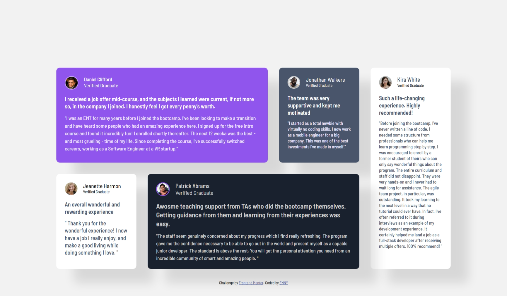
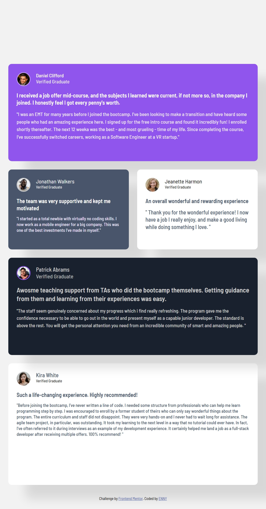

# Frontend Mentor - Testimonials grid section solution

This is a solution to the [Testimonials grid section challenge on Frontend Mentor](https://www.frontendmentor.io/challenges/testimonials-grid-section-Nnw6J7Un7). Frontend Mentor challenges help you improve your coding skills by building realistic projects. 

## Table of contents

- [Overview](#overview)
  - [The challenge](#the-challenge)
  - [Screenshot](#screenshot)
  - [Links](#links)
- [My process](#my-process)
  - [Built with](#built-with)
  - [Useful resources](#useful-resources)
  - [AI Collaboration](#ai-collaboration)
- [Author](#author)

## Overview

### The challenge

Users should be able to:

- View the optimal layout for the site depending on their device's screen size

### Screenshot

### Links

- Solution URL: [solution URL](https://github.com/lekaneniola476-commits/testimonials-grid-section-main)
- Live Site URL: [live site URL](https://lekaneniola476-commits.github.io/testimonials-grid-section-main/)

## My process

### Built with

- Semantic HTML5 markup
- CSS custom properties
- Flexbox
- CSS Grid
- Mobile-first workflow

### AI Collaboration

I used ChatGPT as an AI assistant throughout the project, mainly for debugging, understanding CSS concepts, and exploring different solutions when I got stuck.

I used it particularly to:

Understand and troubleshoot CSS Grid layouts.
Learn how grid-template-columns, grid-template-rows, and grid-template-areas work.
Debug layout issues and understand why elements were overlapping or positioned incorrectly.
Get guidance on making the design responsive for tablet and mobile screen sizes.
Discuss different approaches before implementing them in my own code.

What worked well was using AI to explain why something was happening, rather than just giving me the code. This helped me understand concepts such as Grid alignment, responsive layouts, and media queries.

What didn't work as well was blindly applying suggested solutions. Some approaches caused new layout problems, so I had to test the changes in my browser, identify what wasn't working, and adjust the CSS. This taught me that AI suggestions still need to be tested and understood before being used.

## Author

- Website - [ENNY](https://lekaneniola476-commits.github.io/testimonials-grid-section-main/)
- Frontend Mentor - [@lekaneniola476-commits](https://www.frontendmentor.io/profile/lekaneniola476-commits)
- Twitter - [@rising476](https://x.com/rising476)

